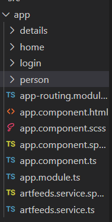
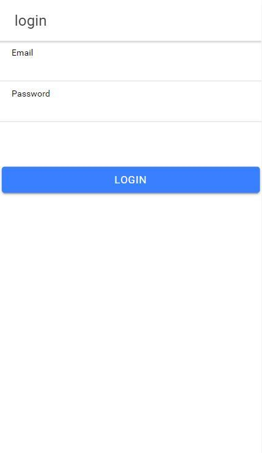
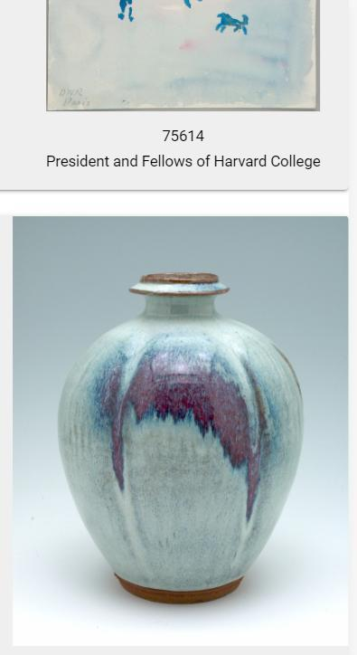
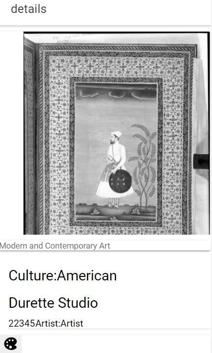
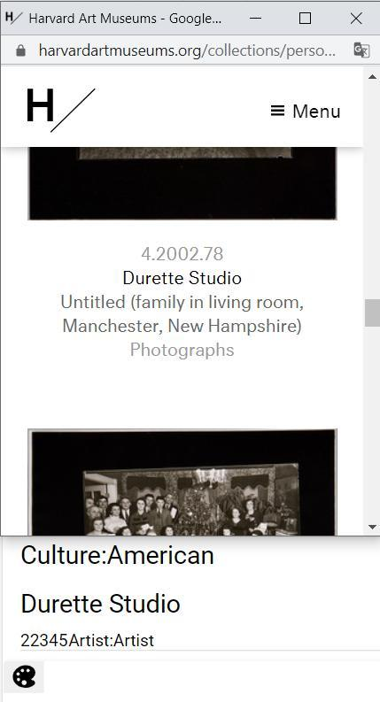

# mobilArtApp
# Sanat Eseri Tanıtım Uygulaması
DailyArt uygulamasından esinlenilmiştir.Harward Sanat Müzesi eserlerini incelenmesini sağlar.
# Kurulum
Projeyi çalıştırmak için gerekli komutlar sırasıyla verilmiştir
indirmek için:

    git clone https://github.com/aysegulacarr/mobilArtApp.git
npm indirmek için:

    npm install
    
ionic çalıştırmak için:

    ionic serve
    
# Temel Bilgiler

 - Kullanıcı verileri Firebase Firestore veritabanında tutulur
 - Harvard museum api kullanılarak kullanıcıya eserler ve bilgileri sunulur.
 
# konfigürasyon

Harvars art api erişim alınıp kullanılabilir https://github.com/harvardartmuseums/api-docs#access-to-the-api

Cordava eklentisi eklentisi için:
 
        ionic cordova plugin add cordova-plugin-inappbrowser
        
        npm install @ionic-native/in-app-browser
        
# Uygulama Kullanımı

   - Girişi için login ekranından kayıtlı kullanıcı maili ve şifresi alınır.
   - Kullanıcı bilgileri doğru ise uygulamaya giriş yapılır.
   - Günlük güncellenen eserlerden rastgele 10 tanesine ulaşılır.
   - Eser incelenmek istenirse üstüne tıklandığında detaylar saayfasında eğer kaydı varsa hangi 
        - kültüre ait olduğu
        - yılı
        - eser sahibi 
        - sergi adı
        - numaraları 
        
        vb. bilgiler gösterilir.
        
   - Detaylar sayfasınının en altındaki palet iconuna çift tıklandığında detay sayfasındaki eserin sahibinin diğer eserlerine ek sekme açarak yönlendirir.
   
# Özellikler

  - Firebase Authentication
  - Firestore
  - İonic Storage
  - ngModel
  - Routing
  - Reactive form
  - In App Browser
  
 
# Ekran görüntüleri

Dosya düzeni

login:

Firebase authentication ile kayıtlı kullanıcıların giriş yapıp akış sayfasına girişi saylar.

home:

Ana akışın gerçekleştiği günlük rastgele 10 verinin çağrılıp görüntülendiği kısımdır.

details:

Seçilen eser hakkında detaylı bilginin göüntülenmesini sağlar.İconda tıklandığında browserdan kişi eserlerine yönlendirilir.

artfeeds:

harvard museum API eser ve detayları çağırılır.

Login Sayfası

Akış sayfası

Detay sayfası

Kişinin diğer eserlerine  yönlendirilir->

